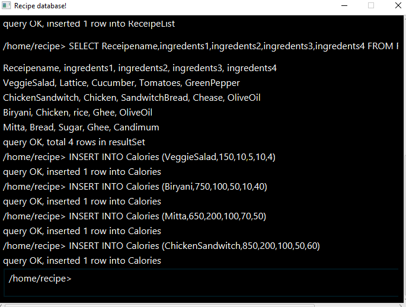
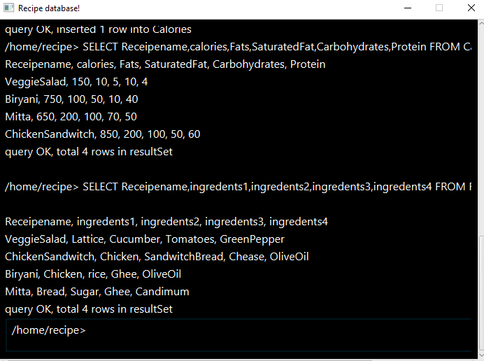

# Recipe Database  
This is a very small database that stores in *one file* a full database. The database accept the following basic commands:  
```sql
CREATE TABLE <table_name> (column1, column2, ...)
SELECT column1, column2, ... FROM <table_name>
INSERT INTO <table_name> (value1, value2, ....)
LIST
```
The user can create as many tables as he/she wants, insert values for whatever table he/she wants, select any number of columns from an individual table and list down all tables with their schema. 

# Technical Details
The program is designed to respect the MVC pattern.   
The `Database.java` represents a Model called `Database`.  
The `recipe-view.fxml` is a view that is presented to the user.  
The `Controller.java` is a controller that controls the interaction between view and model.  
For sake of abstraction we have `DatabaseManager.java` which abstracts the interaction of controller with the database implementation.  
The `Database` is nothing but a `HashMap` of tables mapping table-names to their actual `Table` object. A `Table` is nothing but a collection of `HashMap` for where each map represents a column in the table.  

*Where is inner class?*  
`Table` is an inner-class inside class `Database` which is implemented in `Database.java#L10`  

*Where is lambda expression?*  
There are multiple places where we have used lambda expression.  
[1] We have used lambda expression at `Database.java#L87` with `forEach` loop to iterate through the list of tables while loading the database from file. This is helpful for debugging purposes.  
[2] We have used lambda expression at `Database.java#L131` again with `forEach` loop to iterate through the list of tables for `LIST` command.  
[3] There is an extensive use of lambda expression in `Controller.java` where we have used lambda expressions for adding event listeners. Examples are `L79 & L84`  

*Where is main class or how to run application?*  
`RecipeApplication.java` is the main class that runs the JavaFx application. You can simply open the project in IntelliJ and run its main method!  

*What have you used that's not covered in class?*  
- Firstly as mentioned in bold we have implemented the logic of storing the full database in one file. This logic is covered in `Database::saveDatabase( )` and `Database::loadDatabase( )`. In terms of technical details we have made our `Database` and `Table` classes serializable so that we can directly read/write them from/to file.  
- Also we have used regular expression for parsing commands and capturing the required inputs. This implementation is covered under `DatabaseManager::executeQuery( )`  


# Screenshots  
The following section presents a sample run of the application.  
  
  
  


